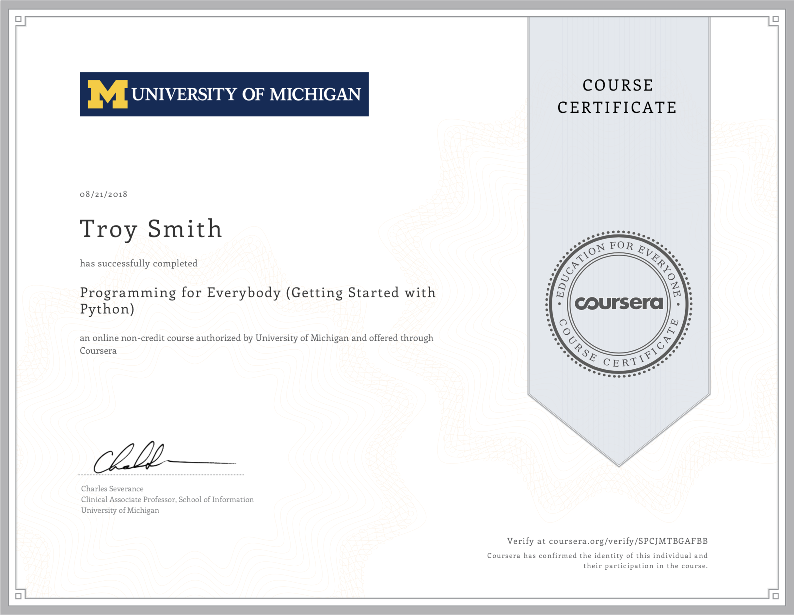
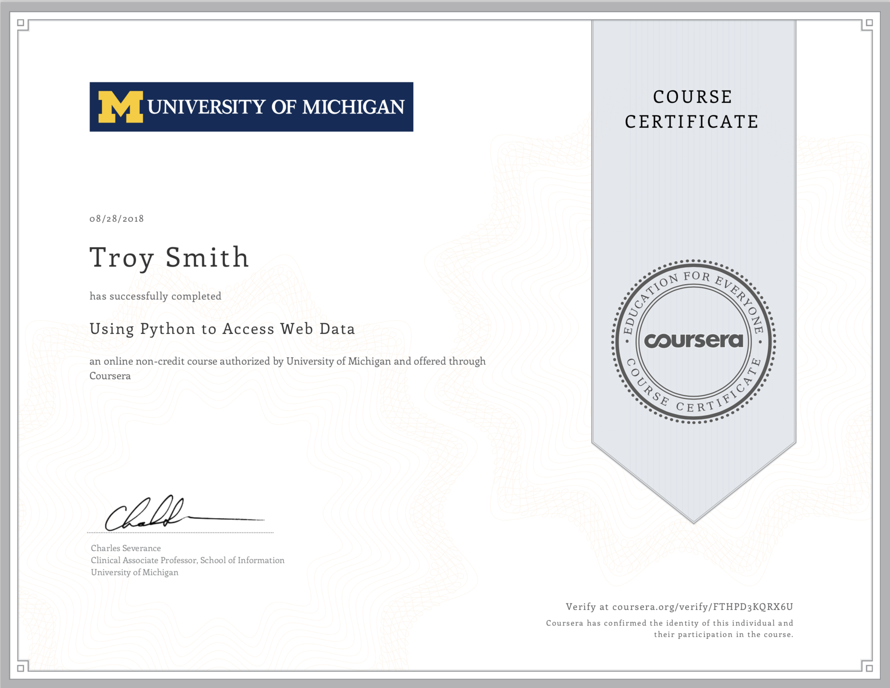

# Python for Everybody Specialization

## University of Michigan

### Course 1: Programming for Everybody (Getting Started with Python)

### Course 2: Python Data Structures

### Course 3: Using Python to Access Web Data

### Course 4: Using Databases with Python

### Course 5: Capstone: Retrieving, Processing, and Visualizing Data with Python

